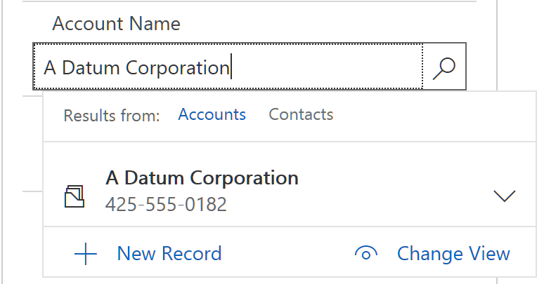

## D365SalesRvlFramework

This is a demo framework. The parent test contains all the objects and low level actions implemented in one of two ways:

1. An action may be an RVL sheet
2. or it may be a JavaScript function in User.js.

Examples of RVL actions:

1. Login
2. GoHome

Example of JavaScript actions:

1. ChangeArea
2. SelectTab
3. LookupField
4. SetDate

Note: test cases are implemented as Sub Tests and should share objects and user-defined code with the parent test.

### Usage of Actions

To use RVL-based action in RVL of a test case choose `Functions` as Object and `Run` as action. Specify low-level action name in `name` parameter.

To use JavaScript-based action in RVL of a test case choose `Functions` as Object and low-level action name as Action, provide parameter values if required.


### Login

To make login work in your environment create `Config.json` in the root folder of the framework and place the following line there (set your own password):

```javascript
{"password":"<your password>"}
```

### Custom Actions Reference

You may find example of each action in TestCase1/Main.rvl.xlsx

#### ChangeArea

In your test learn the button that expands the popup menu and give it the name `OpenAreaList`  (already done in this framework).


In RVL choose this action and specify area name to select.

#### SelectTab


In RVL choose this action and specify tab name.

#### LookupField



Learn the field. In RVL choose this action and specify object id and field value to select.

#### SetDate


Learn the field. In RVL choose this action and specify object id and field value to select.


